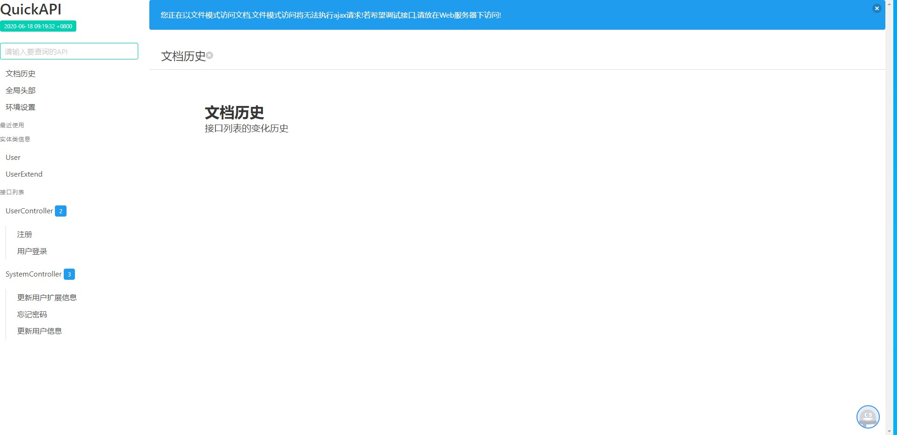
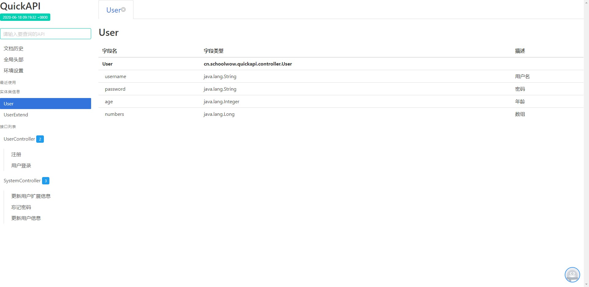
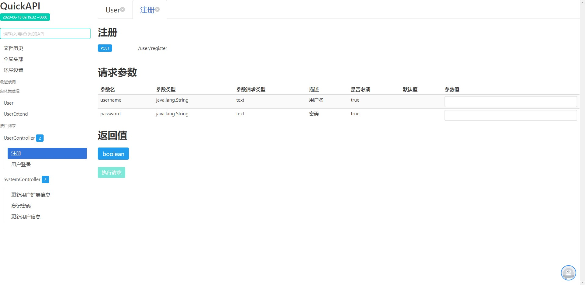
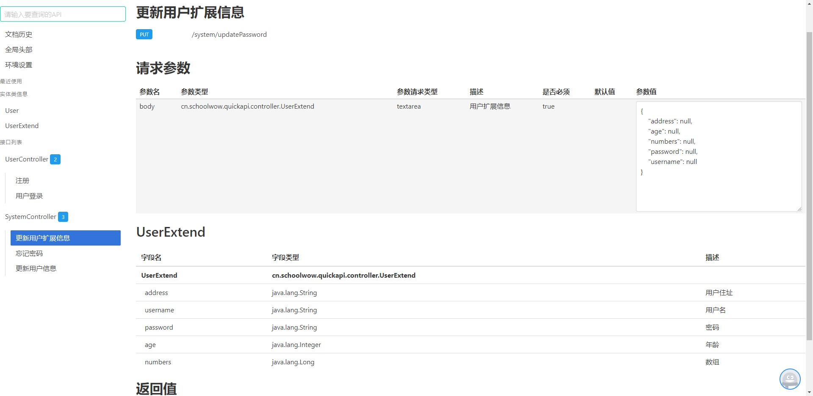

# QuickAPI

一款接口文档生成工具

# 原理

QuickAPI通过反射获取类信息,提取SpringMVC框架里相关注解(@RequestMapping,@RequestParam等),最终生成一个html静态文件

# 使用

## 1 引入QuickAPI
```xml
<dependency>
      <groupId>cn.schoolwow</groupId>
      <artifactId>QuickAPI</artifactId>
      <version>2.0</version>
      <scope>test</scope>
    </dependency>
```

> 您也可以在项目的Release页面获取最新的jar包

## 2 在JUnit中使用
```java
QuickAPI.newInstance()
                .controller("cn.schoolwow.quickapi.controller")
                .sourcePath(System.getProperty("user.dir")+"/src/test/java")
                .directory("./src/main/resources")
                .url("/doc")
                .generate();
```

|方法名|默认值|说明|
|---|---|---|
|controller|无|待扫描包,QuickAPI会扫描该目录下的控制器类,可多次调用此方法|
|sourcePath|``System.getProperty("user.dir")+"/src/main/java"``|指定Java源文件(.java文件)所在目录|
|directory|``./src/main/resources``|html文件生成目录|
|url|""|html文件生成url路径|
|generate|无|生成文件|

# 详细参数文档

|方法名|是否必须|默认值|说明|
|---|---|---|---|
|controller|是|无|待扫描包,QuickAPI会扫描该目录下的控制器类,可多次调用此方法|
|sourcePath|否|``System.getProperty("user.dir")+"/src/main/java"``|指定Java源文件(.java文件)所在目录|
|classPath|否|系统类加载器所加载的类|扫描的.class文件所在目录,可多次调用|
|lib|否|无|jar包文件所在目录,QuickAPi会扫描并加载该目录下的.jar文件|
|prefix|否|""|路径前缀,并在所有url前添加此前缀,默认为空|
|ignorePackageName|否|无|需要忽略的包|
|ignoreClass|否|无|需要忽略的类|
|filter|否|无|自定义逻辑是否需要忽略该类|
|directory|否|``./src/main/resources``|html文件生成目录|
|url|否|""|html文件生成url路径|
|generate|是|无|生成文件|
|upload|否|无|上传API文档到QuickAPI服务器(搭配QuickAPIServer项目使用)|

# 贡献

本开源项目还在不断完善中,欢迎有识之士一起来完善项目.

# 实际截图




